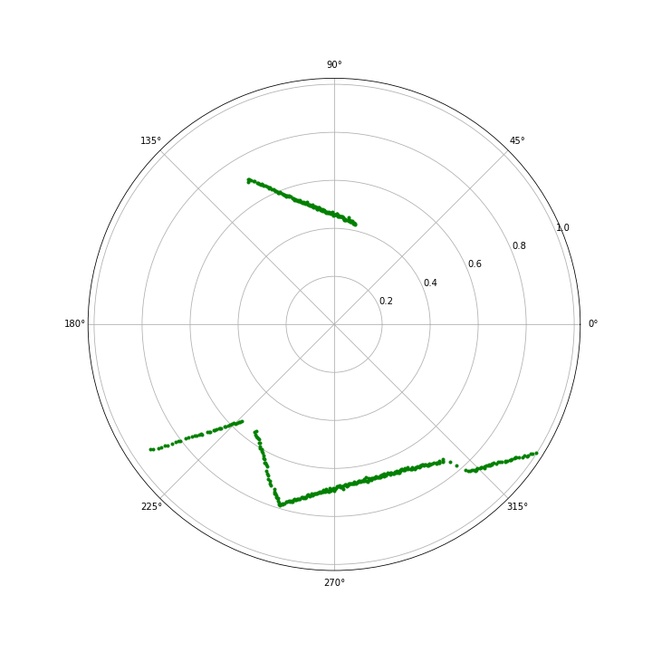

# LiDAR Noise Filtering

Scripts developed to filter noise in [LaserScans](http://docs.ros.org/en/noetic/api/sensor_msgs/html/msg/LaserScan.html), gathered by an Industrial Mobile Robot's LiDAR sensors. The code subscribes to a LaserScan topic, filters out any readings outside a specified range, applies median deviation filtering to remove noise, and publishes the filtered LaserScan to a new topic.

**Note:** Modify the topics for the subscriber and publisher to match your robot's configuration.


## Messages 

All messages types are [sensor_msgs/LaserScan](http://docs.ros.org/en/api/sensor_msgs/html/msg/LaserScan.html) with the following definition:
```
float32 angle_min
float32 angle_max
float32 angle_increment
float32 time_increment
float32 scan_time
float32 range_min
float32 range_max
float32[] ranges
float32[] intensities
```
## Range Filter

Common practice in the following scripts is using a `Range Filter` before applying their core filter. We perform this practice in order to focus on close proximity noise which creates most of our problems. `Range Filter` replaces values that are below min or above max with None. It returns the filtered scan and the indices of the not None values. An example is being displayed below:

<p align="center">
   
</p>


#### Parameters
- `scan:` The scan which will be filtered
- `min:` The minimum range for a laser scan reading to be included
- `max:` The maximum range for a laser scan reading to be included

## Median Deviation

`median_deviation()` divides the received scan in regions defined by a number of rays. For each region the algorithm calculates the [median](https://docs.python.org/3/library/statistics.html#statistics.median) and then checks if any element of the region deviates from it more than 20%. In that case replace the element value with an extreme one e.g. 10m. Then it returns the filtered scan.

The algorithm also checks if the procedure of region division leaves any part of the scan excluded. In that case it performs the same actions for the remainder of the scan.

<p align="center">
  
</p>

#### Parameters
- `scan:` The scan which will be filtered
- `window:` The size of the sliding window used for median deviation filtering

## License

This code is licensed under the MIT License.
